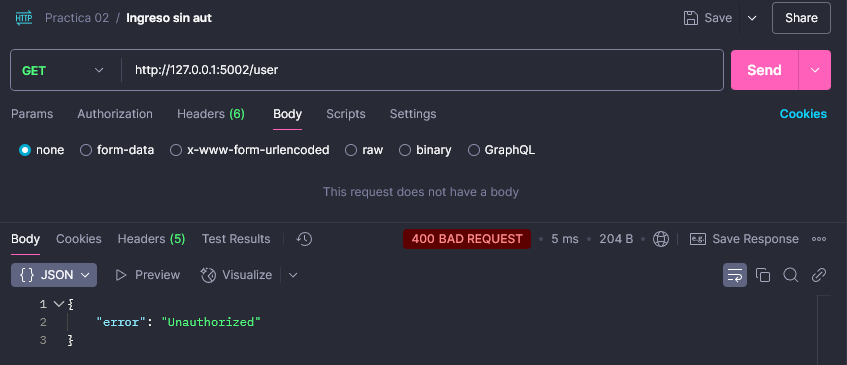

# Flask JWT Authentication API

Este repositorio contiene dos aplicaciones Flask que implementan autenticación con JSON Web Tokens (JWT). La primera aplica un sistema de login para generar un token OAuth y la segunda gestiona usuarios con autenticación basada en JWT.

## Instalación

1. Clona este repositorio:
   ```sh
   git clone https://github.com/CDanielAg/Construccion_Software_2025_A.git
   cd '.\Construccion_Software_2025_A\Practica 02\'
   ```
2. Instala las dependencias necesarias:
   ```sh
   pip install flask pyjwt
   ```

## Aplicaciones

### 1. Generación de Token OAuth

Ubicado en `server_token.py`, este código expone un endpoint para autenticarse y recibir un JWT.

- **Ruta:** `POST /oauth/token`
- **Cuerpo de la petición (JSON):**
  ```json
  {
    "username": "admin",
    "password": "1234"
  }
  ```
- **Respuesta exitosa:**
  ```json
  {
    "access_token": "eyJhbGciOiJI..."
  }
  ```

Para ejecutar:
```sh
python oauth_server.py
```

### 2. Gestión de Usuarios con Autenticación JWT

Ubicado en `backend_server.py`, este servicio permite obtener y actualizar usuarios autenticados con un token JWT.

- **Ruta para obtener usuarios:** `GET /user`
  - Requiere el token en los headers:
    ```
    Authorization: Bearer <token>
    ```
- **Ruta para actualizar usuario:** `PUT /user`
  - Cuerpo de la petición (JSON):
    ```json
    {
      "id": "scvs98ds98d7c98s7d",
      "name": "nuevo_nombre",
      "email": "nuevo_email@gmail.com"
    }
    ```

Para ejecutar:
```sh
python backend_server.py
```

## Pruebas en Postman
### 1. Generar Token 
Se genera el token usando una validación de identidad, en este caso un usuario con permiso. 

En el codigo se incluyo el usuario admin con la contraseña 1234 para ser el unico usuario que puede generar tokens esto en un caso real, se tendría que realizar con una bd.

### 2. Ingreso sin autorización
En caso de que alguien ingrese a la ruta sin tener autorizacion, manda el error 400 junto a un mensaje en json.


### 3. Ingreso con autorización
Para poder lograr un ingreso correcto existen 2 formas aplicables:
- **Con  Authorization**:
    1. Abrir la pestaña de Authorization.

    

    2. Marcar Bearer token.

    

    3. Pegar el token.

    
- **Con Headers**:
    1. Abrir la pestaña de Headers.

    

    2. En key colocar "Authorization".
    
    

    3. En value escribir "Bearer < token >".

    

## Notas
- Los tokens generados expiran en 1 hora.
- La base de datos de usuarios es un arreglo en memoria, no persistente.
